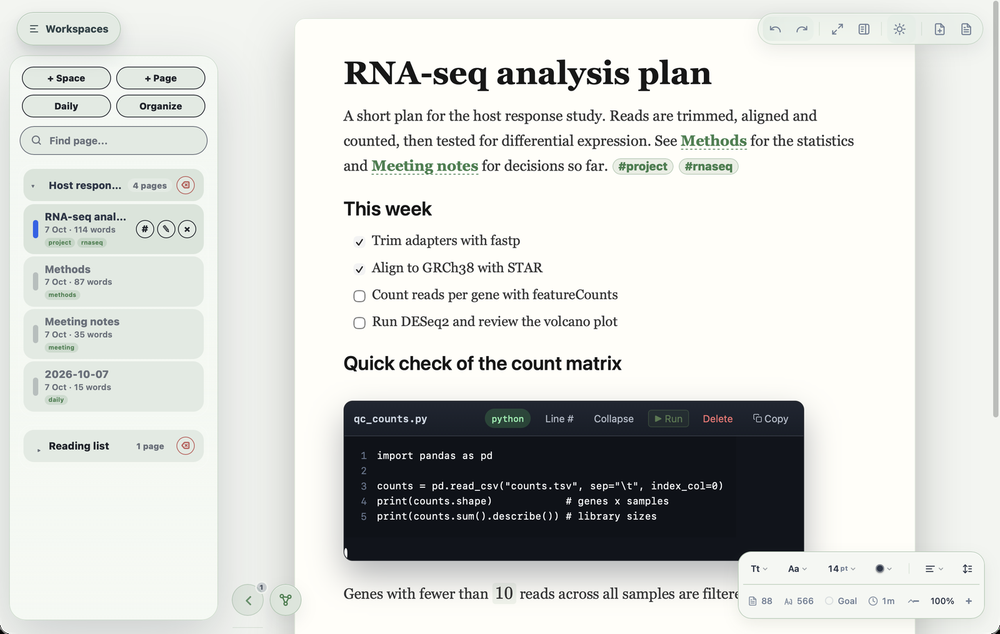
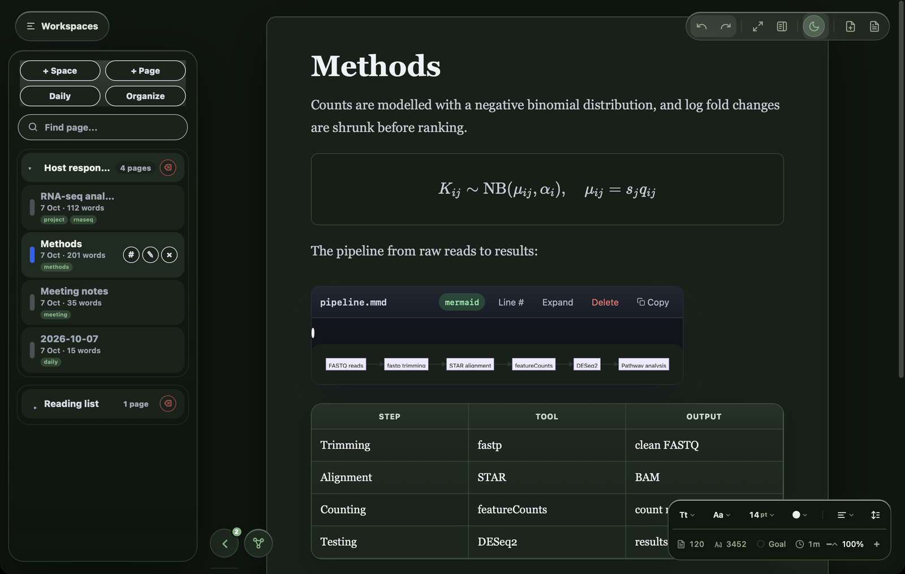
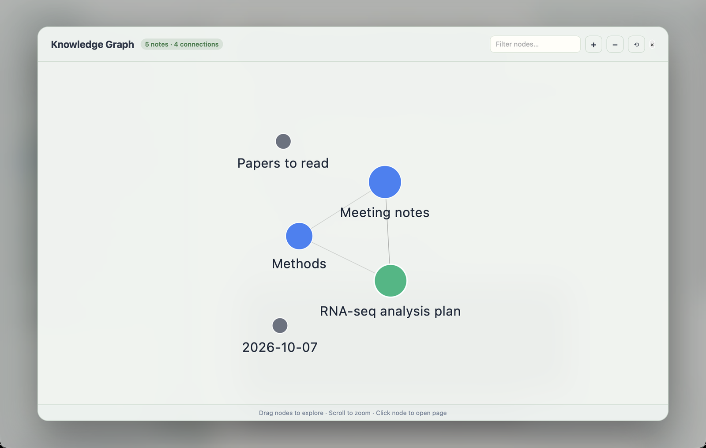
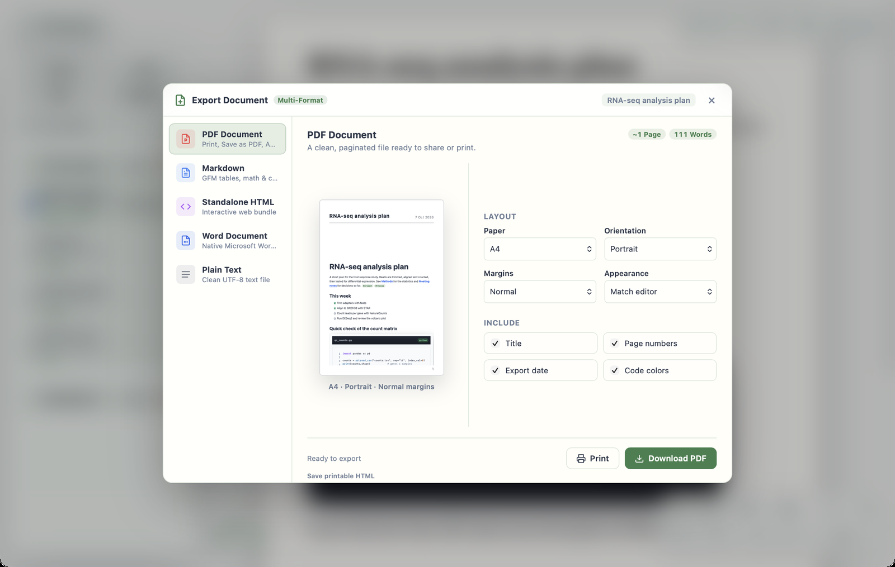

# Frank — a place for your words, code, and ideas

Frank is a Mac writing app for notes and documents that need more than plain text. Write a project brief, keep research notes, explain an idea with code and equations, or connect pages into a workspace you can return to later.

It brings a document-style editor together with linked notes, technical writing tools, and familiar export formats. It is useful for students, researchers, developers, and people who want their explanations and working notes in one place.

**[Download Frank Full 6.0](https://github.com/7drbw7mdgf-lgtm/frank/releases/download/v6.0/Frank-6.0.dmg)** · **[Download Frank Lite](https://github.com/7drbw7mdgf-lgtm/frank/releases/download/lite-v1.0.0/Frank-Lite-1.0.0.dmg)**

*Frank 6.0 with an illustrative project workspace. All screenshots use example content.*

## What you can make with Frank

- **Notes you can find again.** Keep project notes, meeting notes, and daily notes together. Organize pages with folders, tags, and search.
- **Connected ideas.** Link pages, follow backlinks, and explore their relationships in a knowledge graph.
- **Technical documents.** Include formatted code blocks, equations, diagrams, tables, images, and checklists alongside your explanation.
- **Focused writing sessions.** Use Focus mode, adjust the appearance, and set a word-count goal.
- **Documents you can share.** Import Markdown, code files, DOCX, and Frank documents. Export to formats including Markdown, DOCX, PDF, and HTML, or turn your writing into a slide presentation.

For example, keep a project brief, meeting notes, and implementation notes in one space. Add a code example to the explanation, link the relevant pages, and export the finished document for someone who does not use Frank.

## A quick tour

### Write with code, checklists and linked pages

Type `[[Page name]]` to link pages and `#tag` to tag them. Code blocks have syntax highlighting, file names, and a **Run** button for Python, shell, R and Ruby.

### Equations, diagrams and tables — in light or dark

Write LaTeX between `$…$` or `$$…$$` and it renders as you type. Mermaid code blocks become diagrams, and Markdown tables become editable tables. Every theme has a light and a dark mode.

### See how your notes connect

The knowledge graph (⌘G) shows every page and the links between them. Click a node to open that page.

### Export for people who don't use Frank

The Export Hub turns a page into PDF, Markdown, standalone HTML, Word or plain text, with a live preview and page settings.

## What's new in 6.0

- **Safer documents.** A shared `.fm` or `.md` file, a pasted embed, or a web page can no longer reach Frank's native features such as running code or saving files. External links open in your browser.
- **Keyboard shortcuts.** ⌘C, ⌘V, ⌘X, ⌘A and ⌘Q work through a standard Edit menu.
- **A caret that stays put.** Typing no longer jumps to the top of the page after an equation or link renders, and pages reopen where you left off.
- **Cleaner equations.** Formulas select as one block and copy as LaTeX.
- **Better pasting.** Pasted text keeps its paragraphs and lands where the caret is. Markdown keeps headings, lists and code.
- **Real page layout.** Paragraphs that would cross a page boundary move to the next page, and page numbers count consistently. The page-break toolbar button is gone.
- **Knowledge graph fixed.** Links between pages now appear as connections.

Full details are in the [6.0 installation guide](full/MACOS-INSTALL.md#whats-new-in-60).

## Full or Lite?

| | Frank Full 6.0 | Frank Lite 1.0.0 |
| --- | --- | --- |
| Writing and technical-document tools | Included | Included |
| Spaces | No built-in cap | **1 space** |
| Saved pages | No built-in cap | **3 pages total** |
| Best suited to | Growing projects and a larger notes collection | Trying Frank or keeping a small workspace |
| Download | [Full DMG](https://github.com/7drbw7mdgf-lgtm/frank/releases/download/v6.0/Frank-6.0.dmg) | [Lite DMG](https://github.com/7drbw7mdgf-lgtm/frank/releases/download/lite-v1.0.0/Frank-Lite-1.0.0.dmg) |
| Install | [Full guide](full/MACOS-INSTALL.md) | [Lite guide](lite/MACOS-INSTALL.md) |

A **space** groups your work. A **page** is a saved note or document within it. Lite's three-page limit counts these documents, not the number of printed sheets inside a document. Imports, copies, templates, daily notes, and new linked pages all use the same limit. Close or delete a page to make room, exporting its contents first if needed.

Lite uses separate workspace and settings storage from Full. It can coexist with the Full app. Lite is still on 1.0.0 and does not yet include the 6.0 changes.

## Get started in three steps

1. Download your edition, open the DMG, and drag **Frank.app** or **Frank Lite.app** into **Applications**.
2. Open the app and write your first page. Use **+ Page** for another note or **Daily** for a dated scratchpad.
3. Add formatting, code, or other content as needed. Organize and link pages as the project grows, then save or export the document you want to share.

Both editions support **Apple Silicon and Intel Macs running macOS 11 or later**. They are ad hoc signed and not Apple-notarized. If macOS blocks the first launch, follow the [Full](full/MACOS-INSTALL.md) or [Lite](lite/MACOS-INSTALL.md) installation guide. Each DMG includes the matching guide and an app-specific approval helper.

On GitHub Releases, choose the **DMG** to install Frank. Matching downloads and support files are also available in the [full/](full/) and [lite/](lite/) folders.

## Your work and sharing

Frank stores your workspace locally. Folder sync is optional; choose the folder you want to use. AI assistance is optional too, and local model features need their own model setup.

**Local Publish** creates an HTML file on your Mac. Use **Download HTML** to produce a file you can send or host; it does not automatically publish a website on the internet.

## Help and feedback

If something does not work as expected, [open an issue](https://github.com/7drbw7mdgf-lgtm/frank/issues) with your app version, macOS version, and the steps that led to the problem. Feature requests and examples of how you use Frank are welcome.

This repository distributes installers and support files. Editable application source and build/test files are maintained locally. GitHub's automatic source-archive links contain the distribution repository; they are not a separate application source checkout. The installed app includes the resources it needs to run.
